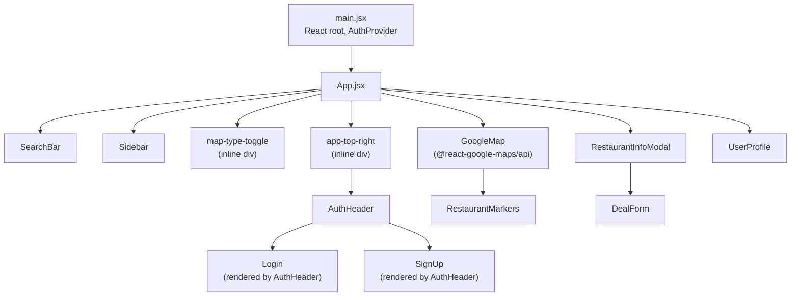

# Component Tree

This document describes the component hierarchy after the refactor, which hooks each component consumes, and the prop interfaces for components with non-trivial contracts.

---

## Component Hierarchy



---

## Hook Consumption

| Component | Hooks consumed |
|---|---|
| `App.jsx` | `useAuth`, `useFavorites`, `useRestaurantSearch`, `useRestaurantFilters`, `useLoadScript` (google-maps) |
| `AuthContext.jsx` | — (provides `useAuth`) |
| `useFavorites.js` | `useAuth` |
| `useRestaurantSearch.js` | `useAuth` |
| `DealForm.jsx` | `useAuth` |
| `UserProfile.jsx` | `useAuth` |
| `AuthHeader.jsx` | `useAuth` |
| All others | No hooks (pure props) |

---

## Key Prop Interfaces

### `Sidebar`
```
restaurants:          Restaurant[]     Filtered + distance-annotated list
onRestaurantSelect:   (r) => void      Pan map + open modal
deals:                Record<id, Deal[]>
isOpen:               boolean
onToggle:             () => void
isFavorite:           (id) => boolean
favoriteRestaurants:  Restaurant[]
user:                 User | null
filters:              { minRating, priceFilter, distanceFilter, cuisineFilter }
setFilter:            (key, value) => void
cuisineOptions:       string[]
onClearFilters:       () => void
```

### `RestaurantMarkers`
```
restaurants:              Restaurant[]
map:                      google.maps.Map | null
hasActiveDealsByPlaceId:  Record<id, boolean>
selectedRestaurant:       Restaurant | null
setSelectedRestaurant:    (r | null) => void
```

### `RestaurantInfoModal`
```
restaurant:        Restaurant | null   null = modal hidden
onClose:           () => void
deals:             Deal[]
onDealAdded:       () => void
isFavorite:        (id) => boolean
isFavoriteLoading: (id) => boolean
toggleFavorite:    (id, data) => void
```

### `useRestaurantSearch` inputs/outputs
```
Input:  { map, currentPosition, searchRadius, isAuthLoading }
Output: { restaurants, hasActiveDealsByPlaceId, syncActiveDealFlags,
          isFetchingRestaurants, placesError, resetSearch, dismissPlacesError }
```

### `useRestaurantFilters` inputs/outputs
```
Input:  restaurantsWithDistance: Restaurant[]
Output: { filters, setFilter, clearFilters, filteredRestaurants, cuisineOptions }
```
