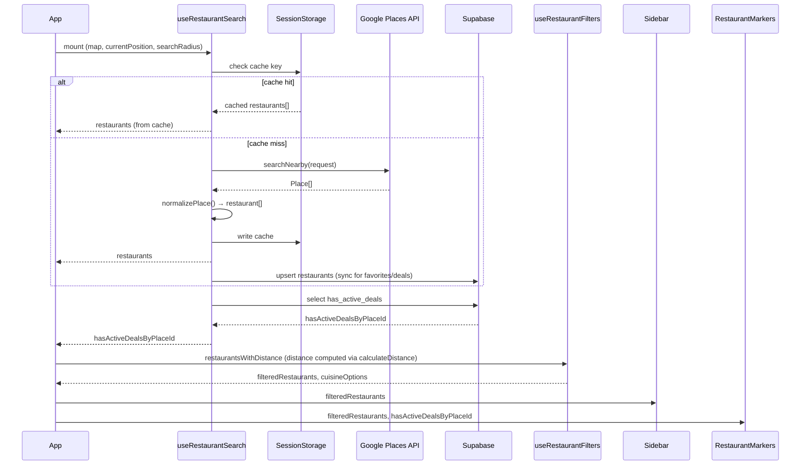
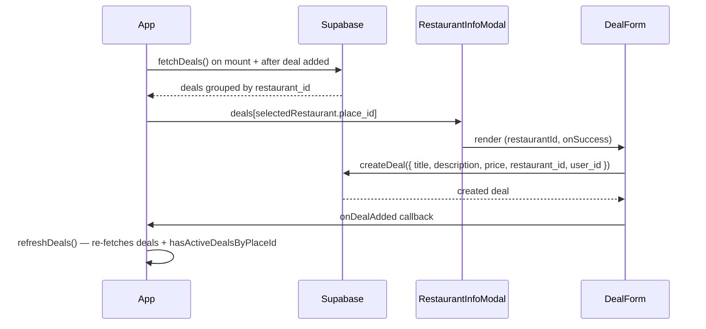
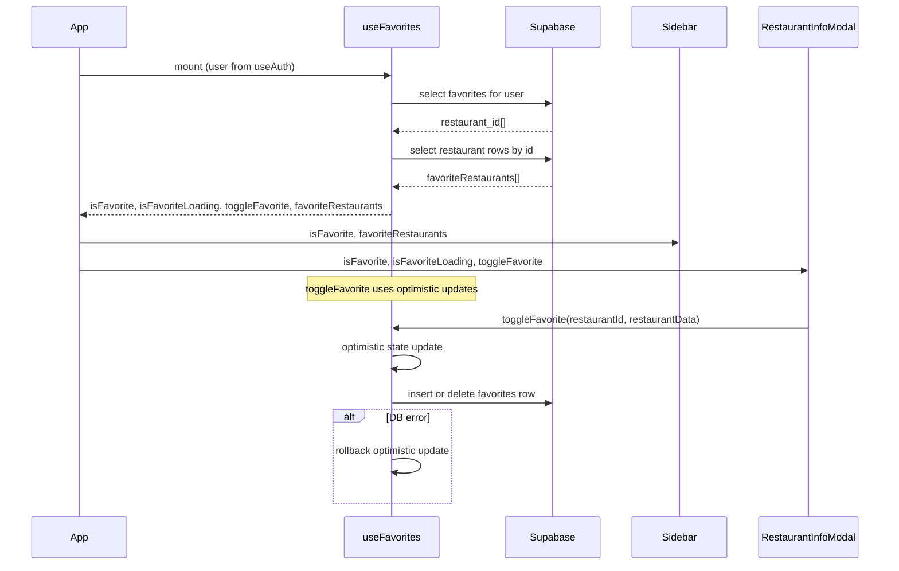

# Data Flow

This document describes how the three main data domains — restaurants, deals, and favorites — move through the application.

---

## Restaurant Data Flow

---

## Deals Data Flow

---

## Favorites Data Flow

