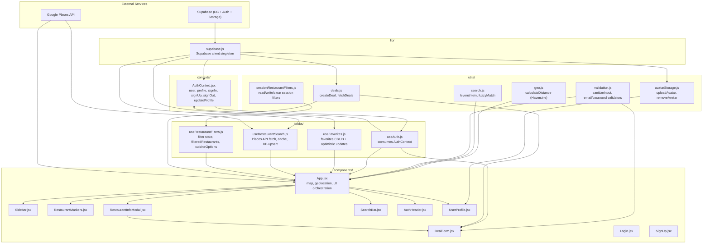

# Architecture Overview

This document describes the layer structure of the 582-project web application and how each layer relates to the others.

## Layer Diagram

## Layer Responsibilities

| Layer | Responsibility |
|---|---|
| `lib/` | Third-party client instantiation (one file per client) |
| `utils/` | Pure functions and thin service wrappers — no React, no state |
| `contexts/` | Global React state shared across the tree (auth only) |
| `hooks/` | Stateful domain logic consumed by components |
| `components/` | Rendering and user interaction |
