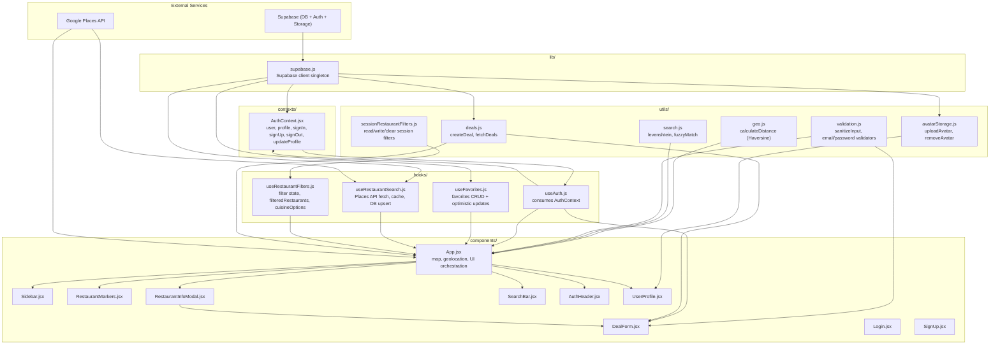
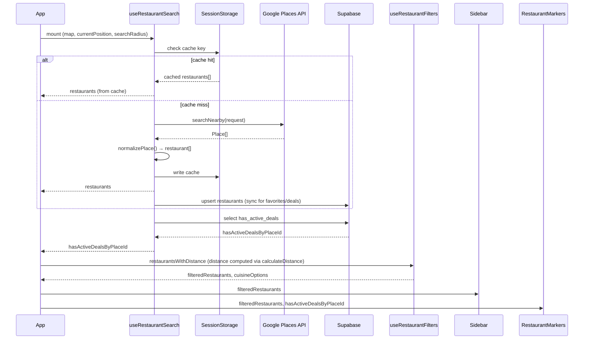
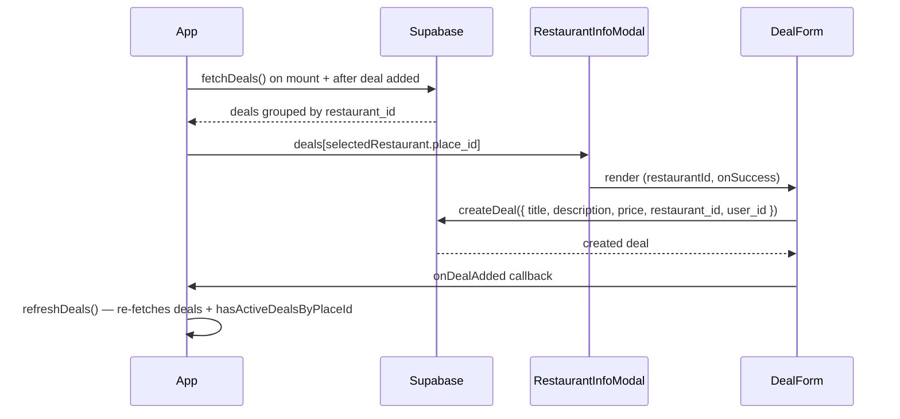
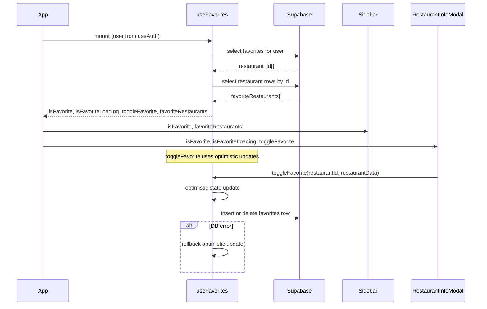
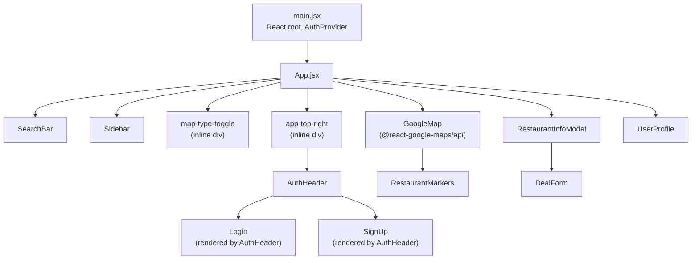

# Refactor Implementation Plan

> **For agentic workers:** REQUIRED SUB-SKILL: Use superpowers:subagent-driven-development (recommended) or superpowers:executing-plans to implement this plan task-by-task. Steps use checkbox (`- [ ]`) syntax for tracking.

**Goal:** Decompose `App.jsx` from a 627-line god component into focused hooks and utilities, restructure component interfaces, and add architecture documentation.

**Architecture:** Extract pure logic into `utils/`, extract stateful domain concerns into custom hooks (`useRestaurantSearch`, `useRestaurantFilters`), then fix component coupling (`RestaurantInfoModal` placement, `Sidebar` prop interface), and finally document the resulting architecture with Mermaid diagrams.

**Tech Stack:** React 18, Vite, Supabase JS v2, `@react-google-maps/api`, sessionStorage, CSS Modules (co-located CSS files)

> **Note:** Tests are explicitly deferred. Verification steps use `npm run build` to catch import/compile errors.

---

## File Map

### New files
| File | Responsibility |
|---|---|
| `src/utils/search.js` | `levenshtein`, `fuzzyMatch` pure functions |
| `src/utils/geo.js` | `calculateDistance` Haversine utility |
| `src/hooks/useRestaurantSearch.js` | Places API fetch, session cache, Supabase upsert, `hasActiveDealsByPlaceId` |
| `src/hooks/useRestaurantFilters.js` | 4 filter states, sessionStorage sync, `filteredRestaurants`, `cuisineOptions` |
| `src/components/RestaurantMarkers.css` | `.restaurant-label` style class |
| `docs/architecture/overview.md` | Layer relationship diagram |
| `docs/architecture/data-flow.md` | Data flow diagrams (restaurants, deals, favorites) |
| `docs/architecture/component-tree.md` | Component hierarchy and prop interface diagram |

### Modified files
| File | Changes |
|---|---|
| `src/App.jsx` | Remove inline functions/hooks extracted above; import from new modules; render `RestaurantInfoModal` directly; remove debug logs |
| `src/utils/validation.js` | No changes — `sanitizeInput` already exists |
| `src/utils/sessionRestaurantFilters.js` | No changes — `clearSessionRestaurantFilters` already exists |
| `src/components/Sidebar.jsx` | Replace 8 filter props with `filters` + `setFilter` |
| `src/components/RestaurantMarkers.jsx` | Remove modal render and 5 now-unneeded props; apply CSS class |
| `src/components/DealForm.jsx` | Add `user_id` to deal insert payload |
| `src/App.css` | Document `--map-toggle-left` pixel values |

---

## Phase 1 — Utils Layer

### Task 1: Create `src/utils/search.js`

**Files:**
- Create: `src/utils/search.js`
- Modify: `src/App.jsx`

- [ ] **Step 1: Create `src/utils/search.js`**

```js
/** Levenshtein edit distance between two strings. */
export function levenshtein(a, b) {
  const matrix = Array.from({ length: b.length + 1 }, (_, i) => [i]);
  for (let j = 0; j <= a.length; j++) matrix[0][j] = j;
  for (let i = 1; i <= b.length; i++) {
    for (let j = 1; j <= a.length; j++) {
      matrix[i][j] =
        b[i - 1] === a[j - 1]
          ? matrix[i - 1][j - 1]
          : 1 + Math.min(matrix[i - 1][j], matrix[i][j - 1], matrix[i - 1][j - 1]);
    }
  }
  return matrix[b.length][a.length];
}

/**
 * Fuzzy-matches a query against a restaurant name.
 * Each word in the query must either be a substring of some word in the name
 * or be within an edit-distance threshold of it (1 typo for words ≥4 chars,
 * 2 typos for words ≥7 chars).
 */
export function fuzzyMatch(query, name) {
  const queryWords = query.toLowerCase().split(/\s+/);
  const nameWords = name.toLowerCase().split(/\s+/);
  return queryWords.every((qw) =>
    nameWords.some((nw) => {
      if (nw.includes(qw) || qw.includes(nw)) return true;
      const maxDist = qw.length <= 3 ? 0 : qw.length <= 6 ? 1 : 2;
      return levenshtein(qw, nw) <= maxDist;
    })
  );
}
```

- [ ] **Step 2: Update `src/App.jsx` — remove inline definitions, import from `utils/search.js`**

Remove lines 39–69 (the `levenshtein` and `fuzzyMatch` function definitions) from `App.jsx`.

Add to the import block at the top of `App.jsx`:
```js
import { fuzzyMatch } from "./utils/search";
```

`levenshtein` is an internal implementation detail of `fuzzyMatch` and does not need to be imported into `App.jsx`.

- [ ] **Step 3: Verify build**

```bash
cd /c/Users/Tuan-PC/GitHub/582-project && npm run build
```

Expected: build succeeds with no errors.

- [ ] **Step 4: Commit**

```bash
git add src/utils/search.js src/App.jsx
git commit -m "refactor: extract levenshtein/fuzzyMatch to utils/search.js"
```

---

### Task 2: Create `src/utils/geo.js`

**Files:**
- Create: `src/utils/geo.js`
- Modify: `src/App.jsx`

- [ ] **Step 1: Create `src/utils/geo.js`**

```js
/**
 * Calculates the Haversine distance between two geographic coordinates.
 * @param {{ lat: number, lng: number }} coordA
 * @param {{ lat: number, lng: number }} coordB
 * @returns {{ distanceMeters: number, distanceMiles: number }}
 */
export function calculateDistance(coordA, coordB) {
  const toRad = (deg) => (deg * Math.PI) / 180;
  const earthRadiusMeters = 6371000;
  const dLat = toRad(coordB.lat - coordA.lat);
  const dLng = toRad(coordB.lng - coordA.lng);
  const a =
    Math.sin(dLat / 2) * Math.sin(dLat / 2) +
    Math.cos(toRad(coordA.lat)) *
      Math.cos(toRad(coordB.lat)) *
      Math.sin(dLng / 2) *
      Math.sin(dLng / 2);
  const c = 2 * Math.atan2(Math.sqrt(a), Math.sqrt(1 - a));
  const distanceMeters = earthRadiusMeters * c;
  return {
    distanceMeters,
    distanceMiles: distanceMeters / 1609.344,
  };
}
```

- [ ] **Step 2: Update `src/App.jsx` — replace inline Haversine with `calculateDistance`**

Add import to `App.jsx`:
```js
import { calculateDistance } from "./utils/geo";
```

Replace the `restaurantsWithDistance` useMemo body (currently lines 378–406) with:
```js
const restaurantsWithDistance = useMemo(() => {
  if (!currentPosition) return restaurants;
  return restaurants.map((restaurant) => {
    const location = restaurant.geometry?.location;
    const lat = typeof location?.lat === "function" ? location.lat() : location?.lat;
    const lng = typeof location?.lng === "function" ? location.lng() : location?.lng;
    if (typeof lat !== "number" || typeof lng !== "number") {
      console.warn(
        `[restaurantsWithDistance] Missing or invalid coordinates for "${restaurant.name}" (id: ${restaurant.place_id}). location was:`,
        location
      );
      return { ...restaurant, distanceMeters: Number.POSITIVE_INFINITY, distanceMiles: null };
    }
    const { distanceMeters, distanceMiles } = calculateDistance(currentPosition, { lat, lng });
    return { ...restaurant, distanceMeters, distanceMiles };
  });
}, [restaurants, currentPosition]);
```

- [ ] **Step 3: Verify build**

```bash
npm run build
```

Expected: build succeeds with no errors.

- [ ] **Step 4: Commit**

```bash
git add src/utils/geo.js src/App.jsx
git commit -m "refactor: extract Haversine formula to utils/geo.js"
```

---

### Task 3: Clean up remaining `App.jsx` util usage

**Files:**
- Modify: `src/App.jsx`

- [ ] **Step 1: Replace duplicate `sanitize` with imported `sanitizeInput`**

Remove the `sanitize` function definition from `App.jsx` (currently lines 31–36):
```js
// DELETE this entire function:
function sanitize(input) {
  return input
    .replace(/<[^>]*>/g, "")
    .replace(/[<>"'`;]/g, "")
    .trim();
}
```

Add `sanitizeInput` to the import from `utils/validation`:
```js
import { sanitizeInput } from "./utils/validation";
```

In `handleSearch`, replace the call `sanitize(rawQuery)` with `sanitizeInput(rawQuery)`.

- [ ] **Step 2: Replace inline `sessionStorage.removeItem` with `clearSessionRestaurantFilters`**

The import for `sessionRestaurantFilters` currently is:
```js
import {
  readSessionRestaurantFilters,
  SESSION_RESTAURANT_FILTERS_KEY,
} from "./utils/sessionRestaurantFilters";
```

Update it to also import `clearSessionRestaurantFilters`:
```js
import {
  readSessionRestaurantFilters,
  clearSessionRestaurantFilters,
  SESSION_RESTAURANT_FILTERS_KEY,
} from "./utils/sessionRestaurantFilters";
```

In the filter persistence `useEffect`, replace:
```js
sessionStorage.removeItem(SESSION_RESTAURANT_FILTERS_KEY);
```
with:
```js
clearSessionRestaurantFilters();
```

After this change, `SESSION_RESTAURANT_FILTERS_KEY` is only used in the `sessionStorage.setItem` call within that same effect. It is still needed there so keep the import.

- [ ] **Step 3: Verify build**

```bash
npm run build
```

Expected: build succeeds with no errors.

- [ ] **Step 4: Commit**

```bash
git add src/App.jsx
git commit -m "refactor: remove duplicate sanitize fn, use clearSessionRestaurantFilters"
```

---

## Phase 2 — Hooks Layer

### Task 4: Create `src/hooks/useRestaurantFilters.js`

**Files:**
- Create: `src/hooks/useRestaurantFilters.js`
- Modify: `src/App.jsx`
- Modify: `src/components/Sidebar.jsx`

- [ ] **Step 1: Create `src/hooks/useRestaurantFilters.js`**

```js
import { useState, useEffect, useCallback, useMemo } from "react";
import {
  readSessionRestaurantFilters,
  clearSessionRestaurantFilters,
  SESSION_RESTAURANT_FILTERS_KEY,
} from "../utils/sessionRestaurantFilters";

const getInitialFilters = (() => {
  let cached;
  return () => {
    if (cached === undefined) {
      cached = readSessionRestaurantFilters() ?? {
        minRating: 0,
        priceFilter: "",
        distanceFilter: "",
        cuisineFilter: "",
      };
    }
    return cached;
  };
})();

/**
 * Manages the four restaurant list filters, their sessionStorage persistence,
 * and the derived filteredRestaurants and cuisineOptions values.
 *
 * @param {Array} restaurantsWithDistance - Restaurant objects with distanceMeters and distanceMiles attached.
 * @returns {{
 *   filters: { minRating: number, priceFilter: string, distanceFilter: string, cuisineFilter: string },
 *   setFilter: (key: string, value: any) => void,
 *   clearFilters: () => void,
 *   filteredRestaurants: Array,
 *   cuisineOptions: string[],
 * }}
 */
export function useRestaurantFilters(restaurantsWithDistance) {
  const initial = getInitialFilters();
  const [minRating, setMinRating] = useState(initial.minRating);
  const [priceFilter, setPriceFilter] = useState(initial.priceFilter);
  const [distanceFilter, setDistanceFilter] = useState(initial.distanceFilter);
  const [cuisineFilter, setCuisineFilter] = useState(initial.cuisineFilter);

  // Persist filters to sessionStorage on every change
  useEffect(() => {
    const isDefault =
      minRating === 0 && priceFilter === "" && distanceFilter === "" && cuisineFilter === "";
    if (isDefault) {
      clearSessionRestaurantFilters();
    } else {
      sessionStorage.setItem(
        SESSION_RESTAURANT_FILTERS_KEY,
        JSON.stringify({ minRating, priceFilter, distanceFilter, cuisineFilter })
      );
    }
  }, [minRating, priceFilter, distanceFilter, cuisineFilter]);

  const cuisineOptions = useMemo(() => {
    const set = new Set();
    restaurantsWithDistance.forEach((r) => {
      if (Array.isArray(r.cuisine)) {
        r.cuisine.forEach((c) => set.add(c));
      }
    });
    return [...set].sort((a, b) => a.localeCompare(b));
  }, [restaurantsWithDistance]);

  // Clear cuisineFilter if the currently selected cuisine is no longer available
  useEffect(() => {
    if (!cuisineFilter) return;
    if (cuisineOptions.length > 0 && !cuisineOptions.includes(cuisineFilter)) {
      setCuisineFilter("");
    }
  }, [cuisineOptions, cuisineFilter]);

  const setFilter = useCallback((key, value) => {
    switch (key) {
      case "minRating": setMinRating(value); break;
      case "priceFilter": setPriceFilter(value); break;
      case "distanceFilter": setDistanceFilter(value); break;
      case "cuisineFilter": setCuisineFilter(value); break;
      default: console.warn(`useRestaurantFilters: unknown filter key "${key}"`);
    }
  }, []);

  const clearFilters = useCallback(() => {
    setMinRating(0);
    setPriceFilter("");
    setDistanceFilter("");
    setCuisineFilter("");
  }, []);

  const filteredRestaurants = useMemo(() => {
    const priceCeilings = { "$": 15, "$$": 30, "$$$": 60, "$$$$": Infinity };
    const priceFloors = { "$": 0, "$$": 15, "$$$": 30, "$$$$": 60 };
    return restaurantsWithDistance.filter((r) => {
      if (minRating > 0 && !(r.rating && r.rating >= minRating)) return false;
      if (priceFilter && priceCeilings[priceFilter] !== undefined) {
        if (!r.price_range) return false;
        const maxPrice = r.price_range[1];
        if (maxPrice > priceCeilings[priceFilter] || maxPrice <= priceFloors[priceFilter]) return false;
      }
      if (distanceFilter && r.distanceMiles != null) {
        if (r.distanceMiles > Number(distanceFilter)) return false;
      }
      if (cuisineFilter && !(Array.isArray(r.cuisine) && r.cuisine.includes(cuisineFilter))) return false;
      return true;
    });
  }, [restaurantsWithDistance, minRating, priceFilter, distanceFilter, cuisineFilter]);

  return {
    filters: { minRating, priceFilter, distanceFilter, cuisineFilter },
    setFilter,
    clearFilters,
    filteredRestaurants,
    cuisineOptions,
  };
}
```

- [ ] **Step 2: Update `src/App.jsx` — remove filter states and computed values, use `useRestaurantFilters`**

Add import:
```js
import { useRestaurantFilters } from "./hooks/useRestaurantFilters";
```

Remove these state declarations from `App.jsx`:
```js
// DELETE these four lines:
const [minRating, setMinRating] = useState(() => getInitialSessionFilters().minRating);
const [priceFilter, setPriceFilter] = useState(() => getInitialSessionFilters().priceFilter);
const [distanceFilter, setDistanceFilter] = useState(() => getInitialSessionFilters().distanceFilter);
const [cuisineFilter, setCuisineFilter] = useState(() => getInitialSessionFilters().cuisineFilter);
```

Remove the `getInitialSessionFilters` IIFE definition (currently lines 71–84).

Remove the filter persistence `useEffect` (the one that writes to sessionStorage when minRating/priceFilter/distanceFilter/cuisineFilter change).

Remove `clearRestaurantFilters` useCallback.

Remove `cuisineOptions` useMemo.

Remove the cuisine auto-clear `useEffect`.

Remove `filteredRestaurants` useMemo.

Remove from the `searchRadius` reset effect:
```js
// BEFORE (lines 351-357):
useEffect(() => {
  queueMicrotask(() => {
    setHasSearched(false);
    setPriceFilter("");    // <-- remove this line
    setMinRating(0);      // <-- remove this line
  });
}, [searchRadius]);
```

Add the hook call after `restaurantsWithDistance` useMemo:
```js
const { filters, setFilter, clearFilters, filteredRestaurants, cuisineOptions } = useRestaurantFilters(restaurantsWithDistance);
```

Update the `searchRadius` reset effect to also clear price and rating filters (preserving original behavior):
```js
useEffect(() => {
  queueMicrotask(() => {
    setHasSearched(false);
    setFilter("priceFilter", "");
    setFilter("minRating", 0);
  });
}, [searchRadius, setFilter]);
```

Update the `<Sidebar>` render in the JSX — replace the 8 individual filter props with `filters` and `setFilter`:

**Before:**
```jsx
<Sidebar
  restaurants={filteredRestaurants}
  onRestaurantSelect={handleResultSelect}
  deals={deals}
  isOpen={sidebarOpen}
  onToggle={handleSidebarToggle}
  isFavorite={isFavorite}
  isFavoriteLoading={isFavoriteLoading}
  favoriteRestaurants={favoriteRestaurants}
  user={user}
  minRating={minRating}
  onMinRatingChange={setMinRating}
  priceFilter={priceFilter}
  onPriceFilterChange={setPriceFilter}
  distanceFilter={distanceFilter}
  onDistanceFilterChange={setDistanceFilter}
  cuisineFilter={cuisineFilter}
  onCuisineFilterChange={setCuisineFilter}
  cuisineOptions={cuisineOptions}
  onClearFilters={clearRestaurantFilters}
/>
```

**After:**
```jsx
<Sidebar
  restaurants={filteredRestaurants}
  onRestaurantSelect={handleResultSelect}
  deals={deals}
  isOpen={sidebarOpen}
  onToggle={handleSidebarToggle}
  isFavorite={isFavorite}
  isFavoriteLoading={isFavoriteLoading}
  favoriteRestaurants={favoriteRestaurants}
  user={user}
  filters={filters}
  setFilter={setFilter}
  cuisineOptions={cuisineOptions}
  onClearFilters={clearFilters}
/>
```

Also remove `SESSION_RESTAURANT_FILTERS_KEY` from the `sessionRestaurantFilters` import in `App.jsx` if it is no longer used there (it moved into the hook). The import becomes:
```js
import {
  readSessionRestaurantFilters,
  clearSessionRestaurantFilters,
} from "./utils/sessionRestaurantFilters";
```

And remove `readSessionRestaurantFilters` and `clearSessionRestaurantFilters` from this import too if `getInitialSessionFilters` is now gone — at this point `App.jsx` no longer needs to import from `sessionRestaurantFilters` at all. Remove the import entirely.

- [ ] **Step 3: Update `src/components/Sidebar.jsx` — consume `filters` + `setFilter`**

Replace the destructured props at the top of the `Sidebar` function:

**Before:**
```jsx
function Sidebar({
  restaurants,
  onRestaurantSelect,
  deals,
  isOpen,
  onToggle,
  isFavorite,
  favoriteRestaurants = [],
  user,
  minRating = 0,
  onMinRatingChange,
  priceFilter = "",
  onPriceFilterChange,
  distanceFilter = "",
  onDistanceFilterChange,
  cuisineFilter = "",
  onCuisineFilterChange,
  cuisineOptions = [],
  onClearFilters,
}) {
```

**After:**
```jsx
function Sidebar({
  restaurants,
  onRestaurantSelect,
  deals,
  isOpen,
  onToggle,
  isFavorite,
  favoriteRestaurants = [],
  user,
  filters = { minRating: 0, priceFilter: "", distanceFilter: "", cuisineFilter: "" },
  setFilter,
  cuisineOptions = [],
  onClearFilters,
}) {
  const { minRating, priceFilter, distanceFilter, cuisineFilter } = filters;
```

The rest of the `Sidebar` body can keep using `minRating`, `priceFilter`, `distanceFilter`, `cuisineFilter` as local names from the destructure above. Only the `onChange` handlers change:

| Before | After |
|---|---|
| `onChange={(e) => onMinRatingChange(Number(e.target.value))}` | `onChange={(e) => setFilter("minRating", Number(e.target.value))}` |
| `onChange={(e) => onPriceFilterChange(e.target.value)}` | `onChange={(e) => setFilter("priceFilter", e.target.value)}` |
| `onChange={(e) => onDistanceFilterChange(e.target.value)}` | `onChange={(e) => setFilter("distanceFilter", e.target.value)}` |
| `onChange={(e) => onCuisineFilterChange(e.target.value)}` | `onChange={(e) => setFilter("cuisineFilter", e.target.value)}` |

- [ ] **Step 4: Verify build**

```bash
npm run build
```

Expected: build succeeds with no errors.

- [ ] **Step 5: Commit**

```bash
git add src/hooks/useRestaurantFilters.js src/App.jsx src/components/Sidebar.jsx
git commit -m "refactor: extract filter state into useRestaurantFilters hook"
```

---

### Task 5: Create `src/hooks/useRestaurantSearch.js`

**Files:**
- Create: `src/hooks/useRestaurantSearch.js`
- Modify: `src/App.jsx`

- [ ] **Step 1: Create `src/hooks/useRestaurantSearch.js`**

```js
import { useState, useEffect, useCallback } from "react";
import { supabase } from "../lib/supabase";
import { useAuth } from "../contexts/useAuth";

/**
 * Normalizes a Google Places API Place object into the internal restaurant shape.
 * @param {google.maps.places.Place} place
 */
function normalizePlace(place) {
  return {
    place_id: place.id,
    name: place.displayName,
    vicinity: place.formattedAddress,
    geometry: {
      location: {
        lat: place.location.lat(),
        lng: place.location.lng(),
      },
    },
    rating: place.rating,
    cuisine:
      place.types
        ?.filter((t) => t.includes("_restaurant"))
        .map((t) =>
          t
            .replace(/_/g, " ")
            .split(" ")
            .map((w) => w.charAt(0).toUpperCase() + w.slice(1))
            .join(" ")
        ) || null,
    price_range:
      place.priceRange?.startPrice && place.priceRange?.endPrice
        ? [
            place.priceRange.startPrice.units + place.priceRange.startPrice.nanos / 1e9,
            place.priceRange.endPrice.units + place.priceRange.endPrice.nanos / 1e9,
          ]
        : null,
  };
}

/**
 * Manages nearby restaurant fetching from the Google Places API,
 * sessionStorage caching, Supabase upsert, and hasActiveDealsByPlaceId sync.
 *
 * @param {{ map: object|null, currentPosition: {lat:number,lng:number}|null, searchRadius: number, isAuthLoading: boolean }} params
 * @returns {{
 *   restaurants: Array,
 *   hasActiveDealsByPlaceId: Record<string, boolean>,
 *   setHasActiveDealsByPlaceId: Function,
 *   isFetchingRestaurants: boolean,
 *   placesError: string|null,
 *   resetSearch: () => void,
 *   dismissPlacesError: () => void,
 * }}
 */
export function useRestaurantSearch({ map, currentPosition, searchRadius, isAuthLoading }) {
  const { user } = useAuth();
  const [restaurants, setRestaurants] = useState([]);
  const [hasSearched, setHasSearched] = useState(false);
  const [isFetchingRestaurants, setIsFetchingRestaurants] = useState(false);
  const [placesError, setPlacesError] = useState(null);
  const [hasActiveDealsByPlaceId, setHasActiveDealsByPlaceId] = useState({});

  const resetSearch = useCallback(() => {
    setHasSearched(false);
    setRestaurants([]);
  }, []);

  // Fetch from Google Places API (or sessionStorage cache)
  useEffect(() => {
    if (isAuthLoading) return;
    if (!map || !currentPosition || hasSearched) return;

    const cacheKey = `restaurants_${currentPosition.lat.toFixed(3)}_${currentPosition.lng.toFixed(3)}_${searchRadius}`;
    const cached = sessionStorage.getItem(cacheKey);

    if (cached) {
      const cachedRestaurants = JSON.parse(cached);
      queueMicrotask(() => {
        setRestaurants(cachedRestaurants);
        setHasSearched(true);
      });
      return;
    }

    const request = {
      fields: ["id", "displayName", "formattedAddress", "location", "types", "rating", "priceRange"],
      locationRestriction: {
        center: currentPosition,
        radius: Math.round(searchRadius * 1609.34),
      },
      includedTypes: ["restaurant"],
      maxResultCount: 20,
    };

    setIsFetchingRestaurants(true);
    window.google.maps.places.Place.searchNearby(request)
      .then((response) => {
        const { places } = response;
        if (places && places.length > 0) {
          const formatted = places.map(normalizePlace);
          setRestaurants(formatted);
          sessionStorage.setItem(cacheKey, JSON.stringify(formatted));
        }
        setHasSearched(true);
      })
      .catch((error) => {
        console.error("Places API search failed:", error);
        const message = navigator.onLine
          ? "Could not load nearby restaurants. The map is still available."
          : "No internet connection. Restaurant data could not be loaded.";
        setPlacesError(message);
        setHasSearched(true);
      })
      .finally(() => {
        setIsFetchingRestaurants(false);
      });
  }, [map, currentPosition, hasSearched, isAuthLoading, searchRadius]);

  // Upsert fetched restaurants into Supabase so the DB stays in sync
  useEffect(() => {
    if (!user || !restaurants.length) return;
    const rows = restaurants.map((r) => ({
      id: r.place_id,
      name: r.name,
      cuisine: r.cuisine,
      rating: r.rating ?? 0,
      price_range: r.price_range,
      lat: r.geometry.location.lat,
      lng: r.geometry.location.lng,
    }));
    supabase
      .from("restaurants")
      .upsert(rows, { onConflict: "id", ignoreDuplicates: true })
      .then(({ error }) => {
        if (error) console.error("Supabase upsert failed:", error);
      });
  }, [user, restaurants]);

  // Load hasActiveDealsByPlaceId from DB when restaurant list changes
  useEffect(() => {
    if (!restaurants.length) return;
    const placeIds = restaurants.map((r) => r.place_id);
    supabase
      .from("restaurants")
      .select("id, has_active_deals")
      .in("id", placeIds)
      .then(({ data, error }) => {
        if (error) return;
        const next = {};
        (data || []).forEach((row) => {
          next[row.id] = !!row.has_active_deals;
        });
        setHasActiveDealsByPlaceId((prev) => ({ ...prev, ...next }));
      });
  }, [restaurants]);

  return {
    restaurants,
    hasActiveDealsByPlaceId,
    setHasActiveDealsByPlaceId,
    isFetchingRestaurants,
    placesError,
    resetSearch,
    dismissPlacesError: () => setPlacesError(null),
  };
}
```

- [ ] **Step 2: Update `src/App.jsx` — remove restaurant fetch logic, use `useRestaurantSearch`**

Add import:
```js
import { useRestaurantSearch } from "./hooks/useRestaurantSearch";
```

Remove these state declarations:
```js
// DELETE:
const [restaurants, setRestaurants] = useState([]);
const [hasSearched, setHasSearched] = useState(false);
const [isFetchingRestaurants, setIsFetchingRestaurants] = useState(false);
const [hasActiveDealsByPlaceId, setHasActiveDealsByPlaceId] = useState({});
```

Remove the `placesError` state declaration (it moves into the hook):
```js
// DELETE:
const [placesError, setPlacesError] = useState(null);
```

Remove the Places API fetch `useEffect` (the large block, currently ~lines 264–349).

Remove the Supabase upsert `useEffect` (currently ~lines 360–376).

Remove the `hasActiveDealsByPlaceId` sync `useEffect` (currently ~lines 215–230).

Add the hook call after `useLoadScript`:
```js
const {
  restaurants,
  hasActiveDealsByPlaceId,
  setHasActiveDealsByPlaceId,
  isFetchingRestaurants,
  placesError,
  resetSearch,
  dismissPlacesError,
} = useRestaurantSearch({ map, currentPosition, searchRadius, isAuthLoading: loading });
```

Update the `searchRadius` reset effect to use `resetSearch`:
```js
useEffect(() => {
  queueMicrotask(() => {
    resetSearch();
    setFilter("priceFilter", "");
    setFilter("minRating", 0);
  });
}, [searchRadius, resetSearch, setFilter]);
```

Remove `setHasSearched` from the `onMapLoad` callback if it was used there (it wasn't — no changes needed there).

Update the `refreshDeals` callback — it still needs `setHasActiveDealsByPlaceId` which is now returned from the hook:
```js
const refreshDeals = useCallback(async () => {
  setIsFetchingDeals(true);
  try {
    const dealsByRestaurant = await fetchDeals();
    setDeals(dealsByRestaurant);
    const placeIds = restaurants.map((r) => r.place_id);
    if (placeIds.length) {
      const { data, error } = await supabase
        .from("restaurants")
        .select("id, has_active_deals")
        .in("id", placeIds);
      if (!error && data) {
        const next = {};
        data.forEach((row) => { next[row.id] = !!row.has_active_deals; });
        setHasActiveDealsByPlaceId((prev) => ({ ...prev, ...next }));
      }
    }
  } catch (err) {
    console.error("Error fetching deals:", err);
    setDealsError("Failed to load deals. Please try again later.");
  } finally {
    setIsFetchingDeals(false);
  }
}, [restaurants, setHasActiveDealsByPlaceId]);
```

Update the `placesError` banner `onClick` to use `dismissPlacesError`:
```jsx
{placesError && (
  <div className="places-error-banner">
    {placesError}
    <button onClick={dismissPlacesError} aria-label="Dismiss">x</button>
  </div>
)}
```

Remove `supabase` import from `App.jsx` if it is only used in `refreshDeals` (it still is — keep it).

- [ ] **Step 3: Verify build**

```bash
npm run build
```

Expected: build succeeds with no errors.

- [ ] **Step 4: Commit**

```bash
git add src/hooks/useRestaurantSearch.js src/App.jsx
git commit -m "refactor: extract Places API fetch logic into useRestaurantSearch hook"
```

---

## Phase 3 — Component Interfaces

### Task 6: Move `RestaurantInfoModal` out of `RestaurantMarkers`

**Files:**
- Modify: `src/components/RestaurantMarkers.jsx`
- Modify: `src/App.jsx`

- [ ] **Step 1: Simplify `src/components/RestaurantMarkers.jsx`**

Remove the `RestaurantInfoModal` import and render. Remove the props `deals`, `refreshDeals`, `isFavorite`, `isFavoriteLoading`, `toggleFavorite`. Remove the `handleCloseModal` function.

The full updated file:
```jsx
import { OverlayView } from "@react-google-maps/api";
import { useEffect, useRef } from "react";
import "./RestaurantMarkers.css";

function RestaurantMarkers({
  restaurants,
  map,
  hasActiveDealsByPlaceId,
  selectedRestaurant,
  setSelectedRestaurant,
}) {
  const markersRef = useRef([]);

  useEffect(() => {
    markersRef.current.forEach((marker) => {
      if (marker.map) marker.map = null;
    });
    markersRef.current = [];

    if (map && window.google && window.google.maps && window.google.maps.marker) {
      const { AdvancedMarkerElement, PinElement } = window.google.maps.marker;

      restaurants.forEach((restaurant) => {
        try {
          const location = restaurant.geometry.location;
          const lat = typeof location.lat === "function" ? location.lat() : location.lat;
          const lng = typeof location.lng === "function" ? location.lng() : location.lng;
          const hasActiveDeals = !!hasActiveDealsByPlaceId?.[restaurant.place_id];

          const markerOptions = {
            map,
            position: { lat, lng },
            title: restaurant.name,
          };
          if (hasActiveDeals) {
            markerOptions.content = new PinElement({
              background: "#00509D",
              borderColor: "#002a5c",
              glyphColor: "#FFD500",
            }).element;
          }

          const marker = new AdvancedMarkerElement(markerOptions);
          marker.addListener("gmp-click", () => {
            setSelectedRestaurant(restaurant);
          });
          markersRef.current.push(marker);
        } catch (err) {
          console.error("Failed to create marker for restaurant:", restaurant?.name, err);
        }
      });
    }

    return () => {
      markersRef.current.forEach((marker) => {
        if (marker.map) marker.map = null;
      });
    };
  }, [restaurants, map, hasActiveDealsByPlaceId, setSelectedRestaurant]);

  return (
    <>
      {restaurants.map((restaurant) => {
        const location = restaurant.geometry?.location;
        if (!location) return null;
        const lat = typeof location.lat === "function" ? location.lat() : location.lat;
        const lng = typeof location.lng === "function" ? location.lng() : location.lng;
        if (!lat || !lng) return null;

        return (
          <OverlayView
            key={restaurant.place_id}
            position={{ lat, lng }}
            mapPaneName={OverlayView.OVERLAY_MOUSE_TARGET}
          >
            <div className="restaurant-label">{restaurant.name}</div>
          </OverlayView>
        );
      })}
    </>
  );
}

export default RestaurantMarkers;
```

- [ ] **Step 2: Create `src/components/RestaurantMarkers.css`**

```css
.restaurant-label {
  font-size: 11px;
  font-weight: bold;
  color: black;
  text-shadow:
    1px 1px 2px white,
    -1px -1px 2px white,
    1px -1px 2px white,
    -1px 1px 2px white;
  transform: translate(-70%, -50px);
  white-space: nowrap;
  pointer-events: none;
  text-align: left;
}
```

- [ ] **Step 3: Update `src/App.jsx` — render `RestaurantInfoModal` directly**

Add import:
```js
import RestaurantInfoModal from "./components/RestaurantInfoModal";
```

Update the `<RestaurantMarkers>` render — remove the 5 props that moved to the modal:

```jsx
<RestaurantMarkers
  restaurants={filteredRestaurants}
  selectedRestaurant={selectedRestaurant}
  setSelectedRestaurant={setSelectedRestaurant}
  map={map}
  hasActiveDealsByPlaceId={hasActiveDealsByPlaceId}
/>
```

Add `RestaurantInfoModal` render just after the closing `</GoogleMap>` tag and before `{showProfile && user && ...}`:

```jsx
<RestaurantInfoModal
  restaurant={selectedRestaurant}
  onClose={() => setSelectedRestaurant(null)}
  deals={selectedRestaurant ? deals[selectedRestaurant.place_id] || [] : []}
  onDealAdded={() => refreshDeals?.()}
  isFavorite={isFavorite}
  isFavoriteLoading={isFavoriteLoading}
  toggleFavorite={toggleFavorite}
/>
```

- [ ] **Step 4: Verify build**

```bash
npm run build
```

Expected: build succeeds with no errors.

- [ ] **Step 5: Commit**

```bash
git add src/components/RestaurantMarkers.jsx src/components/RestaurantMarkers.css src/App.jsx
git commit -m "refactor: move RestaurantInfoModal to App.jsx, simplify RestaurantMarkers props"
```

---

## Phase 4 — Cleanup

### Task 7: Remove debug logs, fix `DealForm` user_id, document CSS variables

**Files:**
- Modify: `src/App.jsx`
- Modify: `src/components/DealForm.jsx`
- Modify: `src/App.css`

- [ ] **Step 1: Remove debug `console.log` calls from `src/App.jsx`**

These three log statements are in the Places API fetch block (now inside `useRestaurantSearch.js` after Phase 2 — verify they were carried over and remove them there):

```js
// DELETE these three lines from useRestaurantSearch.js:
console.log("Searching for restaurants near:", currentPosition);
console.log("API Key exists:", !!import.meta.env.VITE_GOOGLE_MAPS_API_KEY);
console.log("Making Places API request:", request);
```

Also remove from `useRestaurantSearch.js` the cache hit log if it was included:
```js
// DELETE if present:
console.log("Using cached restaurant data");
```

- [ ] **Step 2: Fix `src/components/DealForm.jsx` — add `user_id` to deal payload**

Add `useAuth` import:
```js
import { useAuth } from "../contexts/useAuth";
```

Add the hook call inside the component body, after the existing `useState` declarations:
```js
const { user } = useAuth();
```

Update the `dealInput` object inside `handleSubmit`:
```js
const dealInput = {
  title: sanitizeInput(title),
  description: sanitizeInput(description),
  price: priceNum,
  restaurant_id: restaurantId,
  user_id: user.id,
};
```

- [ ] **Step 3: Document `--map-toggle-left` values in `src/App.css`**

Find the `.map-type-toggle` rule in `App.css`. Add a comment documenting the two values the CSS variable takes:

```css
/* --map-toggle-left is set inline in App.jsx.
   42px  = sidebar closed (toggle button width)
   400px = sidebar open  (sidebar panel width) */
.map-type-toggle {
  /* existing rules unchanged */
```

- [ ] **Step 4: Verify build**

```bash
npm run build
```

Expected: build succeeds with no errors.

- [ ] **Step 5: Commit**

```bash
git add src/App.jsx src/hooks/useRestaurantSearch.js src/components/DealForm.jsx src/App.css
git commit -m "fix: remove debug logs, add user_id to deal inserts, document CSS variables"
```

---

## Phase 5 — Documentation

### Task 8: Create `docs/architecture/overview.md`

**Files:**
- Create: `docs/architecture/overview.md`

- [ ] **Step 1: Create `docs/architecture/overview.md`**

````markdown
# Architecture Overview

This document describes the layer structure of the 582-project web application and how each layer relates to the others.

## Layer Diagram



## Layer Responsibilities

| Layer | Responsibility |
|---|---|
| `lib/` | Third-party client instantiation (one file per client) |
| `utils/` | Pure functions and thin service wrappers — no React, no state |
| `contexts/` | Global React state shared across the tree (auth only) |
| `hooks/` | Stateful domain logic consumed by components |
| `components/` | Rendering and user interaction |
````

- [ ] **Step 2: Commit**

```bash
git add docs/architecture/overview.md
git commit -m "docs: add architecture overview with layer diagram"
```

---

### Task 9: Create `docs/architecture/data-flow.md`

**Files:**
- Create: `docs/architecture/data-flow.md`

- [ ] **Step 1: Create `docs/architecture/data-flow.md`**

````markdown
# Data Flow

This document describes how the three main data domains — restaurants, deals, and favorites — move through the application.

---

## Restaurant Data Flow



---

## Deals Data Flow



---

## Favorites Data Flow


````

- [ ] **Step 2: Commit**

```bash
git add docs/architecture/data-flow.md
git commit -m "docs: add data flow diagrams for restaurants, deals, and favorites"
```

---

### Task 10: Create `docs/architecture/component-tree.md`

**Files:**
- Create: `docs/architecture/component-tree.md`

- [ ] **Step 1: Create `docs/architecture/component-tree.md`**

````markdown
# Component Tree

This document describes the component hierarchy after the refactor, which hooks each component consumes, and the prop interfaces for components with non-trivial contracts.

---

## Component Hierarchy



---

## Hook Consumption

| Component | Hooks consumed |
|---|---|
| `App.jsx` | `useAuth`, `useFavorites`, `useRestaurantSearch`, `useRestaurantFilters`, `useLoadScript` (google-maps) |
| `AuthContext.jsx` | — (provides `useAuth`) |
| `useFavorites.js` | `useAuth` |
| `useRestaurantSearch.js` | `useAuth` |
| `DealForm.jsx` | `useAuth` |
| `UserProfile.jsx` | `useAuth` |
| `AuthHeader.jsx` | `useAuth` |
| All others | No hooks (pure props) |

---

## Key Prop Interfaces

### `Sidebar`
```
restaurants:          Restaurant[]     Filtered + distance-annotated list
onRestaurantSelect:   (r) => void      Pan map + open modal
deals:                Record<id, Deal[]>
isOpen:               boolean
onToggle:             () => void
isFavorite:           (id) => boolean
favoriteRestaurants:  Restaurant[]
user:                 User | null
filters:              { minRating, priceFilter, distanceFilter, cuisineFilter }
setFilter:            (key, value) => void
cuisineOptions:       string[]
onClearFilters:       () => void
```

### `RestaurantMarkers`
```
restaurants:              Restaurant[]
map:                      google.maps.Map | null
hasActiveDealsByPlaceId:  Record<id, boolean>
selectedRestaurant:       Restaurant | null
setSelectedRestaurant:    (r | null) => void
```

### `RestaurantInfoModal`
```
restaurant:        Restaurant | null   null = modal hidden
onClose:           () => void
deals:             Deal[]
onDealAdded:       () => void
isFavorite:        (id) => boolean
isFavoriteLoading: (id) => boolean
toggleFavorite:    (id, data) => void
```

### `useRestaurantSearch` inputs/outputs
```
Input:  { map, currentPosition, searchRadius, isAuthLoading }
Output: { restaurants, hasActiveDealsByPlaceId, setHasActiveDealsByPlaceId,
          isFetchingRestaurants, placesError, resetSearch, dismissPlacesError }
```

### `useRestaurantFilters` inputs/outputs
```
Input:  restaurantsWithDistance: Restaurant[]
Output: { filters, setFilter, clearFilters, filteredRestaurants, cuisineOptions }
```
````

- [ ] **Step 2: Commit**

```bash
git add docs/architecture/component-tree.md
git commit -m "docs: add component tree and prop interface documentation"
```

---

## Self-Review

**Spec coverage check:**
- Phase 1 (utils): Tasks 1–3 ✓
- Phase 2 (hooks): Tasks 4–5 ✓
- Phase 3 (component interfaces): Task 6 ✓
- Phase 4 (cleanup): Task 7 ✓
- Phase 5 (docs): Tasks 8–10 ✓
- `sortBy` preserved: noted in spec, Sidebar untouched ✓
- `user_id` fix with schema prerequisite met ✓

**Placeholder scan:** No TBDs, no "implement later", all code blocks complete.

**Type consistency:**
- `setFilter(key, value)` used consistently in Tasks 4, 5, Sidebar update ✓
- `resetSearch()` defined in Task 5, called in Task 5 App.jsx update ✓
- `dismissPlacesError` defined in Task 5 hook, called in Task 5 App.jsx update ✓
- `setHasActiveDealsByPlaceId` exposed from hook in Task 5, used in `refreshDeals` in Task 5 ✓
- `filters` object shape `{ minRating, priceFilter, distanceFilter, cuisineFilter }` consistent across Task 4 hook, Task 4 Sidebar update, docs ✓
