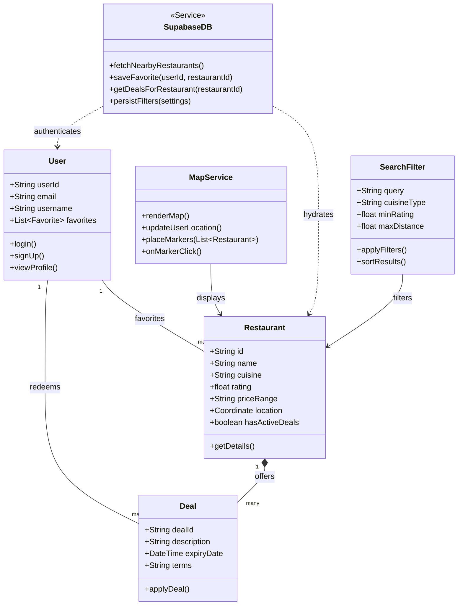

```mermaid
classDiagram
    class User {
        +String userId
        +String email
        +String username
        +List~Favorite~ favorites
        +login()
        +signUp()
        +viewProfile()
    }

    class Restaurant {
        +String id
        +String name
        +String cuisine
        +float rating
        +String priceRange
        +Coordinate location
        +boolean hasActiveDeals
        +getDetails()
    }

    class Deal {
        +String dealId
        +String description
        +DateTime expiryDate
        +String terms
        +applyDeal()
    }

    class MapService {
        +renderMap()
        +updateUserLocation()
        +placeMarkers(List~Restaurant~)
        +onMarkerClick()
    }

    class SupabaseDB {
        <<Service>>
        +fetchNearbyRestaurants()
        +saveFavorite(userId, restaurantId)
        +getDealsForRestaurant(restaurantId)
        +persistFilters(settings)
    }

    class SearchFilter {
        +String query
        +String cuisineType
        +float minRating
        +float maxDistance
        +applyFilters()
        +sortResults()
    }

    User "1" -- "many" Deal : redeems
    User "1" -- "many" Restaurant : favorites
    Restaurant "1" *-- "many" Deal : offers
    MapService --> Restaurant : displays
    SupabaseDB ..> Restaurant : hydrates
    SupabaseDB ..> User : authenticates
    SearchFilter --> Restaurant : filters

```
